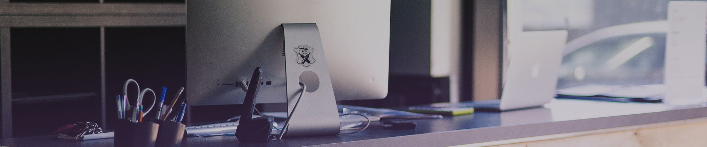

# 🏋️‍♀️ Studio Sport & Coaching

**Studio Sport & Coaching** est un site vitrine moderne, responsive et dynamique pour une salle de sport basée à Biarritz. Il permet de découvrir les activités proposées, d'accéder aux informations de contact, de consulter les offres et de visualiser les partenaires de l'établissement.

---

## 📌 Sommaire

- [🎯 Objectifs](#-objectifs)
- [🛠️ Technologies utilisées](#️-technologies-utilisées)
- [🗂 Structure du projet](#-structure-du-projet)
- [🚀 Fonctionnalités](#-fonctionnalités)
- [⚙️ Installation locale](#️-installation-locale)
- [📷 Aperçu visuel](#-aperçu-visuel)
- [💡 Améliorations futures](#-améliorations-futures)
- [📞 Contact](#-contact)
- [📝 Crédits](#-crédits)

---

## 🎯 Objectifs

Le site a été développé pour répondre aux besoins suivants :
- Promouvoir les activités sportives et le coaching personnalisé
- Permettre aux visiteurs de contacter l'équipe facilement
- Créer une identité visuelle forte et professionnelle
- Offrir une expérience fluide sur mobile, tablette et ordinateur

---

## 🛠️ Technologies utilisées

- **HTML5** – Structure des pages
- **CSS3** – Mise en page & styles personnalisés (`style.css`)
- **JavaScript** – Validation du formulaire de contact (`validation.js`)
- **Bootstrap 5** – Grille responsive, navbar, carousel, etc.
- **FontAwesome / Bootstrap Icons** – Icônes décoratives et sociales
- **Google Maps Embed** – Intégration de la carte interactive

---

## 🗂 Structure du projet

```
.
├── index.html              # Page d'accueil
├── contact.html            # Page de contact + formulaire
├── presentation.html       # Page activités et ateliers
├── 404.html                # Page temporaire pour sections en construction
├── style.css               # Feuille de style principale
├── validation.js           # Script JS pour validation du formulaire
└── /assets
    └── /img                # Images, logos, icônes, galeries, visuels
```

---

## 🚀 Fonctionnalités

- ✅ Site 100% responsive avec Bootstrap
- ✅ Slider/carrousel en page d’accueil
- ✅ Présentation des activités sportives
- ✅ Formulaire de contact validé en JavaScript
- ✅ Carte Google Maps intégrée
- ✅ Références aux partenaires et réseaux sociaux
- ✅ Multilingue prêt (FR / EN flag switch)
- ⚠️ Pages "Offres", "Planning", "Blog" en cours de développement (`404.html`)

---

## ⚙️ Installation locale

1. **Cloner le dépôt :**

```bash
git clone https://github.com/votre-utilisateur/studio-sport-coaching.git
```

2. **Ouvrir dans un navigateur :**

Aucune compilation nécessaire. Il suffit d'ouvrir `index.html` dans votre navigateur préféré.

> *💡 Astuce : utilisez une extension comme "Live Server" sur VS Code pour un rechargement automatique.*

---

## 📷 Aperçu visuel

### 🏠 Page d’accueil


### 📞 Page contact


### 💪 Page activités


---

## 💡 Améliorations futures

- [ ] Création de pages dynamiques pour chaque activité
- [ ] Intégration d’un blog (CMS headless ou statique)
- [ ] Module de prise de rendez-vous
- [ ] Accessibilité renforcée (contraste, navigation clavier)
- [ ] Intégration de Google Analytics et SEO optimisé

---

## 📞 Contact

**Studio Sport & Coaching**  
📍 123 Rue de la Musique, 64200 Biarritz  
📧 contact@studiosportcoaching.com  
📱 0745 678 899

---

## 📝 Crédits

- 👨‍💻 **Développement :** Projet réalisé dans le cadre d’un exercice ou d’un site vitrine professionnel.
- 🎨 **Design :** Basé sur une charte graphique personnalisée
- 🏢 **Agence partenaire :** L'AGENCE 364COM’  
  

---

**© 2025 Studio Sport & Coaching – Tous droits réservés**

